# Diagramas de Arquitectura — Sistema de Historia Clinica Obstetrica

> **Ultima actualizacion:** 2026-02-12
> **Formato:** Mermaid (renderizable en GitHub, GitLab, VS Code con extension, etc.)

---

## 1. Diagrama de Contexto del Sistema (C4 — Nivel 1)

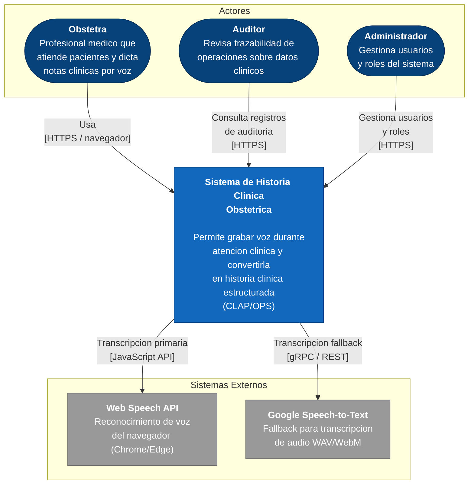

---

## 2. Diagrama de Contenedores (C4 — Nivel 2)

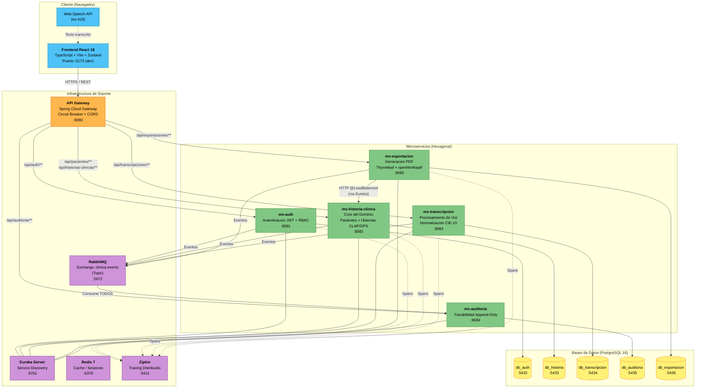

---

## 3. Flujo de Mensajeria (RabbitMQ)

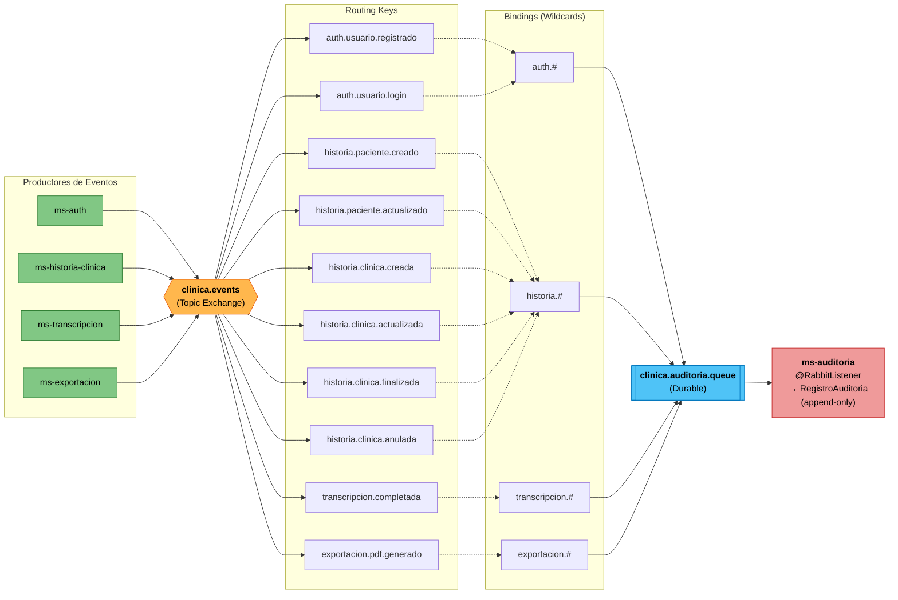

---

## 4. Flujo de Autenticacion y Seguridad

### 4a. Login JWT

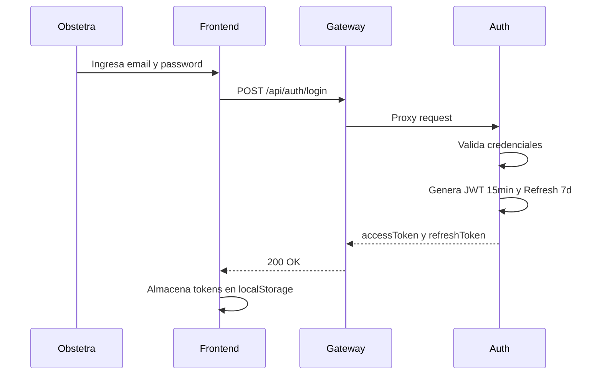

### 4b. Request autenticado

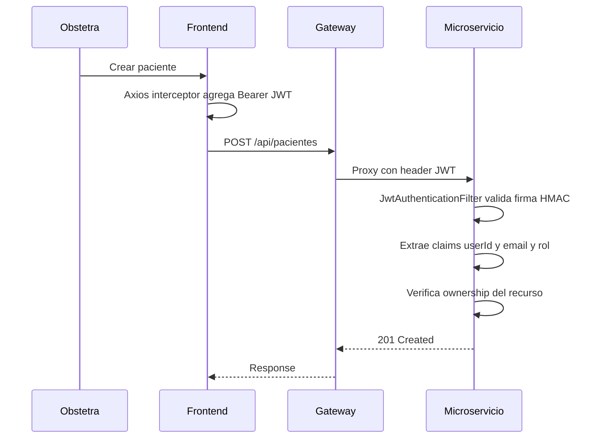

### 4c. Token expirado y auto refresh

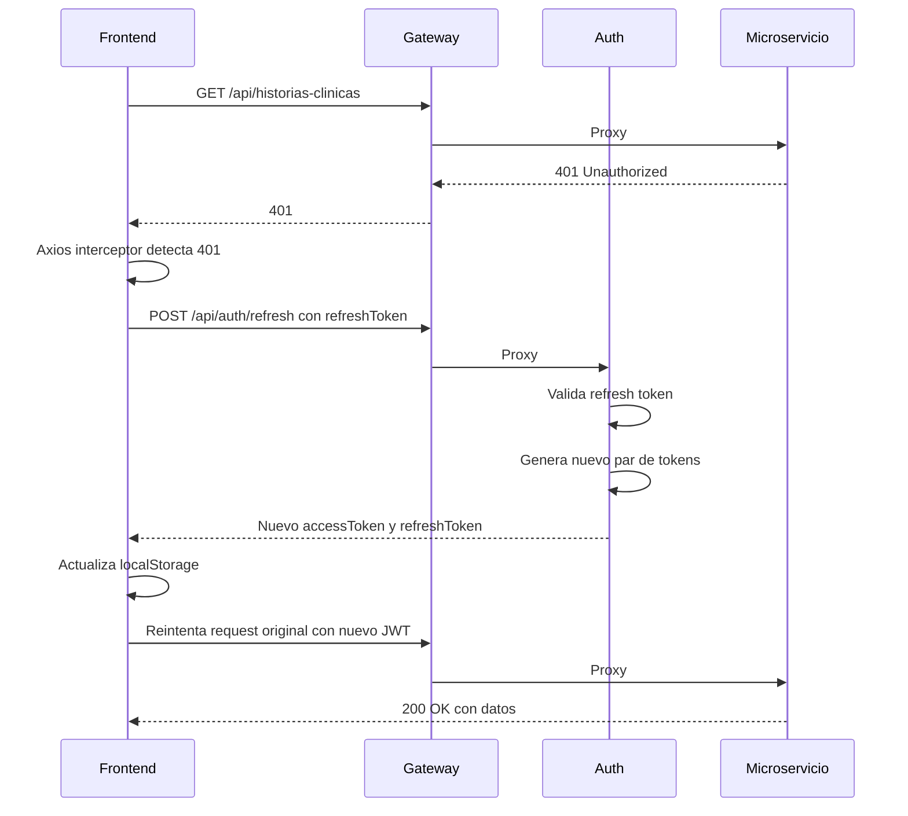

---

## 5. Arquitectura Hexagonal (por Microservicio)

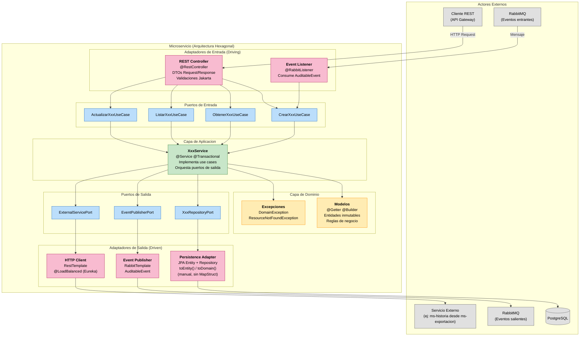

---

## 6. Diagrama de Despliegue (Docker Compose)

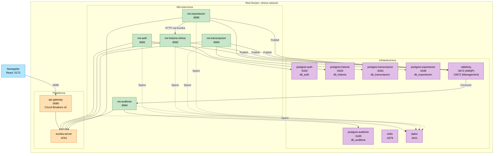

---

### 7a. Flujo: Paciente, Historia y Voz

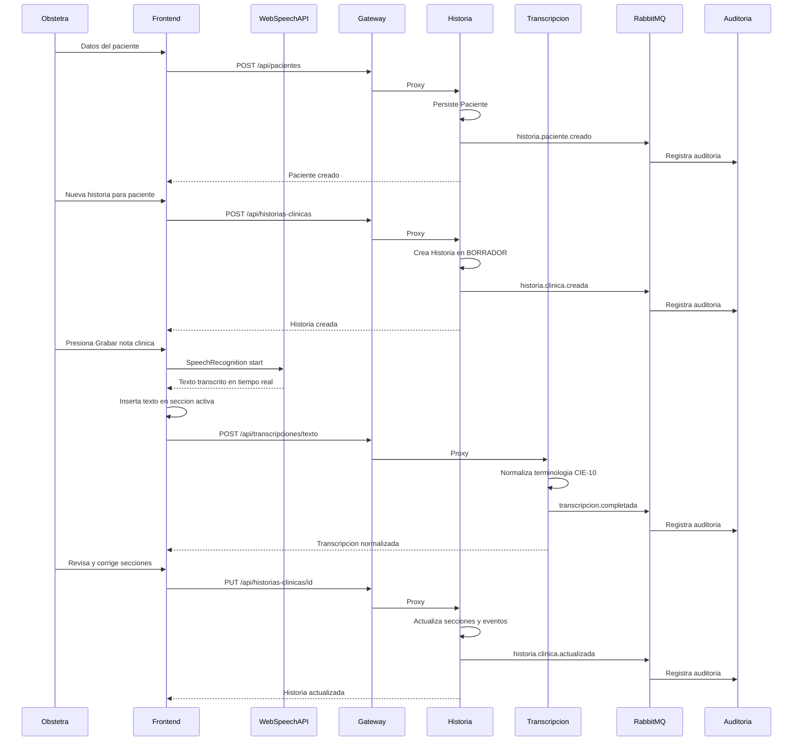

### 7b. Flujo: Finalizar y Exportar PDF

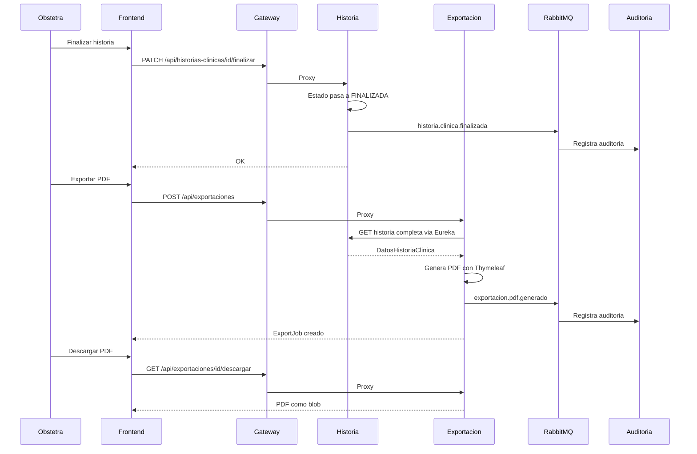

---

## 8. Modelo de Dominio (ms-historia-clinica)

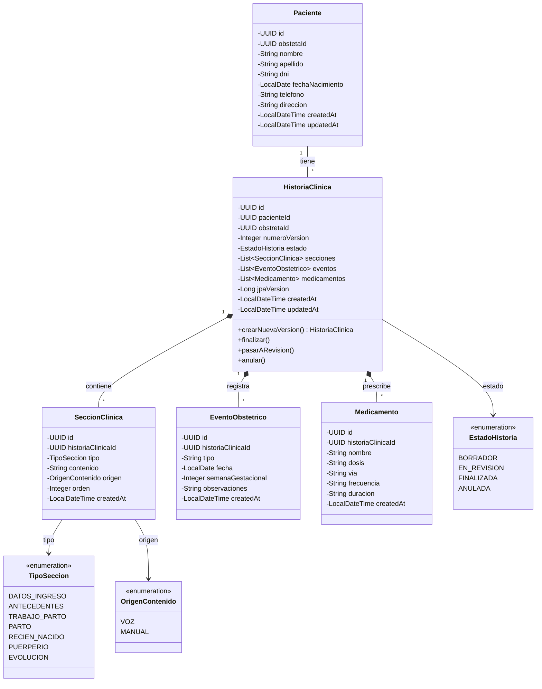

---

## 9. Maquina de Estados — Historia Clinica

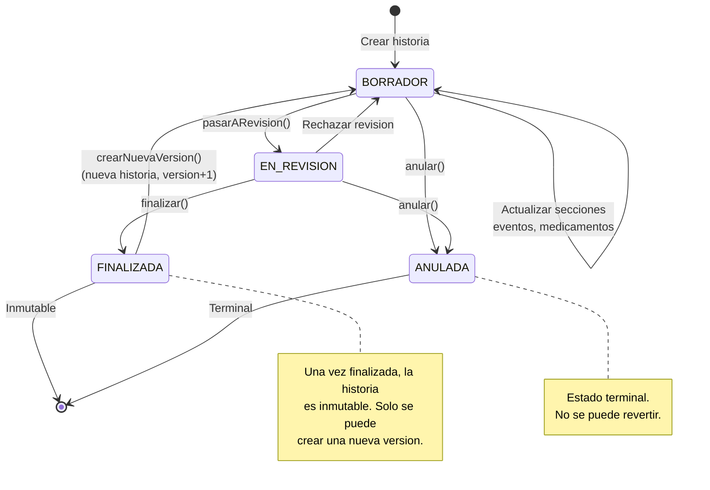

---

## Resumen de Componentes

| # | Diagrama | Descripcion |
|---|----------|-------------|
| 1 | Contexto del Sistema | Vista de alto nivel: actores y sistemas externos |
| 2 | Contenedores | Microservicios, bases de datos, mensajeria, gateway |
| 3 | Mensajeria RabbitMQ | Exchange topic, routing keys, bindings y cola de auditoria |
| 4a | Login JWT | Flujo de autenticacion con credenciales |
| 4b | Request autenticado | Validacion JWT en cada microservicio |
| 4c | Auto refresh | Renovacion automatica de token expirado |
| 5 | Arquitectura Hexagonal | Capas, puertos y adaptadores por microservicio |
| 6 | Despliegue Docker | Contenedores, puertos y red interna |
| 7a | Paciente, Historia y Voz | Crear paciente, historia, dictado y transcripcion |
| 7b | Finalizar y Exportar PDF | Finalizar historia, generar y descargar PDF |
| 8 | Modelo de Dominio | Clases del core: Paciente, Historia, Secciones, Eventos |
| 9 | Maquina de Estados | Ciclo de vida de HistoriaClinica |
